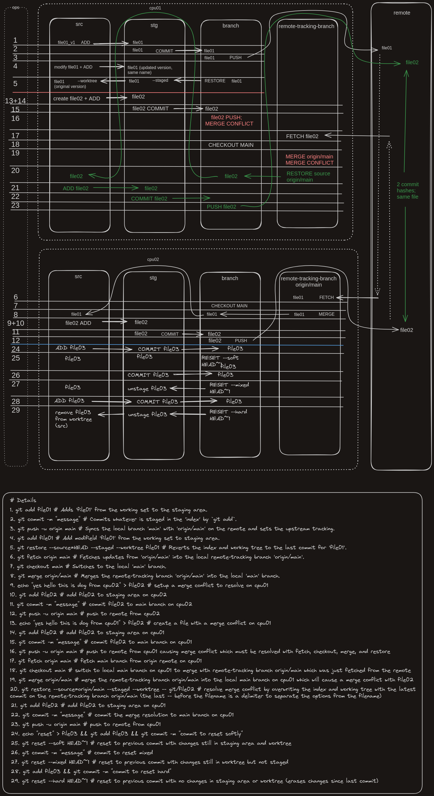

git switch -c section_11_start origin/section_11_start

https://github.com/epicweb-dev/react-server-components/pull/4/files

how do i download this pull request?  
  
@https://github.com/epicweb-dev/react-server-components/pull/4
  
1. Clone the repository if you haven't already:

   git clone https://github.com/epicweb-dev/react-server-components.git

   cd react-server-components

2. Fetch all branches from the remote, including those for pull requests:

   git fetch origin pull/4/head:local-branch-name

Replace local-branch-name with a name you want to give to your local branch.

3. Switch to the new branch to access the pull request's changes:

   git checkout local-branch-name

This will allow you to test and modify the changes proposed in the pull request locally.